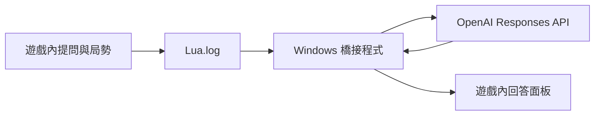

# 文明帝國 VI｜遊戲內 AI 助手

本專案是**嵌入 Civ VI 畫面**的策略助手模組：在遊戲內開啟面板，輸入問題、選擇勝利／建城／生產／區域／研究範例，並在同一面板分頁閱讀回答。無網頁介面。AI 推論使用 OpenAI Responses API，不會替玩家執行遊戲操作。

由於 Civ VI 的 UI Lua 不能直接連線到本機 API，必須**同時啟動** Windows 本機橋接程式 `bridge.py`。模組將當前玩家可見的城市、單位與附近地塊及問題輸出至遊戲的 `Lua.log`；橋接程式呼叫 OpenAI，再經過遊戲中的「接收回答」欄位傳回短篇文字。API Key 只存在於 Windows 終端機環境變數。



## Windows／Steam 安裝

1. 將整個 `steam_mod\Civ6Assistant` 複製到 `%USERPROFILE%\Documents\My Games\Sid Meier's Civilization VI\Mods\`。若 Documents 位於 OneDrive，請改用 OneDrive 的 `Documents\My Games\...\Mods`。模組目錄下應直接有 `Civ6Assistant.modinfo`。
2. 在遊戲「額外內容／模組」啟用 **Civ VI AI Assistant**，重進對局。
3. 安裝 Python 3.10 以上。在專案根目錄的 PowerShell 設定 OpenAI API Key 並啟動：

   ```powershell
   $env:OPENAI_API_KEY = '你的_OpenAI_API_Key'
   python bridge.py
   ```

   Python 程式只用標準函式庫；API Key 不要寫入模組或 Git。可用 `$env:OPENAI_MODEL = 'gpt-5-mini'` 更換預設模型。

4. 遊戲右上按「AI 決策助手」，選擇範例問題或在欄位自行輸入，按「詢問 AI」。稍候在遊戲面板按「接收回答」；若尚未完成，再按一次。保持 Civ VI 視窗在最前方，接收期間請勿點擊其他輸入欄。回答會顯示在面板，使用「上頁／下頁」閱讀。

新啟動的橋接程式會從 Lua.log **末尾**開始監聽，因此啟動後請在遊戲內重新提問。若找不到日誌，可在啟動程式前指定 `$env:CIV6_LUA_LOG = 'C:\完整路徑\Lua.log'`。它會自動嘗試新版 `%LOCALAPPDATA%\Firaxis Games\Sid Meier's Civilization VI\Logs\Lua.log` 及 Documents／OneDrive 的舊路徑。若遊戲視窗標題不同，可設定 `$env:CIV6_WINDOW_TITLE` 為標題中的固定文字。

## 資料與使用界線

- 模組每次提問都重新收集**目前可見**的地塊、城市與單位。它沒有完整地圖、戰爭迷霧資訊，也無法確認所有區域放置限制；建議的座標、加成與前置條件須在遊戲介面核對。
- Windows 橋接程式在按「接收回答」時，暫用系統剪貼簿並對**目前最前方的 Civ VI 視窗**送出貼上快捷鍵。它會嘗試還原原本的**文字**剪貼簿內容；若原先是圖片或其他格式，無法還原該格式。請勿在回答傳輸期間切換焦點。
- 由於遊戲 UI 的 EditBox、貼上與焦點行為需實機驗證，本版本的回程傳輸目前只能視為 Windows／Steam 實驗版；若畫面沒有顯示回答，檢查 `Lua.log` 中 `CIV6AI_CHAT_V1` 的 `ASK`、`READY` 與 `ACK` 行，以及橋接程式的輸出。
- 本專案未發佈到 Steam Workshop，也未在實際 Civ VI 遊戲中完成驗證。

## 開發檢查

```powershell
python -m unittest discover -s tests -v
```

`state.py` 驗證遊戲快照，`advisor.py` 建立 OpenAI 請求，`bridge.py` 協調問題／回答與確認訊息，`windows_delivery.py` 處理 Windows 遊戲內回程。`steam_mod/Civ6Assistant` 是唯一玩家可見 UI。
