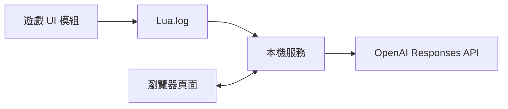

# 文明帝國 VI｜AI 決策助手

這是重新設計的 Civ VI 本機助手，使用 **OpenAI Responses API**。遊戲內 UI 模組將**本地玩家目前可見**的城市、單位與附近地塊輸出至 `Lua.log`；本機 Python 服務解析資料，連同你的問題及可選的截圖交給 AI 回答。它協助決定勝利路線、建城、生產、區域布局、科技與市政。建議不會自動執行遊戲操作。



## 1. Windows 安裝與啟動

需要 Steam 版《文明帝國 VI》、Python 3.10 以上及獨立的 OpenAI API Key。這個專案只用 Python 標準函式庫，無需 `pip install`。API Key 只存在於啟動本機服務的環境變數，不要放入模組、網頁或 Git。

1. 將整個 `steam_mod\Civ6Assistant` 複製至 `%USERPROFILE%\Documents\My Games\Sid Meier's Civilization VI\Mods\`。若文件由 OneDrive 同步，改用該處的 `Documents\My Games\Sid Meier's Civilization VI\Mods`。確認資料夾內直接包含 `Civ6Assistant.modinfo`。
2. 遊戲「額外內容／模組」中啟用 **Civ VI AI Assistant**，重新載入遊戲。在右上角按「匯出局勢」。
3. 用 PowerShell 到本專案根目錄，輸入以下指令（把金鑰換成你的，切勿提交或截圖分享）：

   ```powershell
   $env:OPENAI_API_KEY = '你的_OpenAI_API_Key'
   python server.py
   ```

4. 瀏覽器開啟 `http://127.0.0.1:5001`。左側應顯示目前回合與城市數。每回合或局勢改變後在遊戲內重新按「匯出局勢」，再按網頁「重新讀取」。

可選：在啟動服務前設定 `$env:OPENAI_MODEL = 'gpt-5-mini'`（預設值）；如果無法找到日誌，設定 `$env:CIV6_LUA_LOG = 'C:\完整路徑\Lua.log'`。目前會自動檢查 `%LOCALAPPDATA%\Firaxis Games\Sid Meier's Civilization VI\Logs\Lua.log` 和 Documents／OneDrive 下的舊位置。遊戲內若顯示「匯出失敗」，在 `Lua.log` 搜尋 `CIV6AI_ERROR`，以查明不相容的遊戲 API。

## 2. 提問與截圖

網頁提供勝利、建城、生產、區域、科技市政五類範例問題，也可自由提問。需討論地圖或遊戲選單中精確的合法位置時，使用 Windows `Win+Shift+S` 截圖後在頁面貼上 `Ctrl+V`，或選擇圖片檔。瀏覽器會轉成 PNG，僅附於**下一次**提問；不會自行截取全螢幕。API 請求中的資料包含提問、有限的近期對話、遊戲快照與你選擇附上的截圖。

建城距離、區域可放置性、相鄰加成與科技解鎖可能隨 DLC、模式及其他模組而變。助手會標示未確認條件，最後請在遊戲介面核對。快照只含目前可見格，沒有完整地圖或對手的隱藏資料。

## 3. 結構與檢查

| 路徑 | 用途 |
| --- | --- |
| `steam_mod/Civ6Assistant/` | Civ VI UI 模組；按鈕輸出快照至遊戲日誌 |
| `state.py` | 尋找 Lua.log、驗證完整快照 |
| `advisor.py` | 控制輸入大小、策略指令、呼叫 Responses API |
| `server.py` | 僅監聽 127.0.0.1 的網頁與 API |
| `web/` | 同源聊天頁面及截圖貼上 |
| `tests/` | 模擬日誌與 API 回應的整合測試 |

```powershell
python -m unittest discover -s tests -v
```

`/api/state` 可用於確認遊戲內快照，`/api/health` 會顯示 API Key 是否已設定（不回傳金鑰）。

**驗證狀態：**Python 流程與模組 XML 可在開發環境測試；實際遊戲 UI、不同 DLC 與 Lua 日誌路徑仍需在 Windows／Steam 遊戲中測試。本專案尚未發佈至 Steam Workshop。
